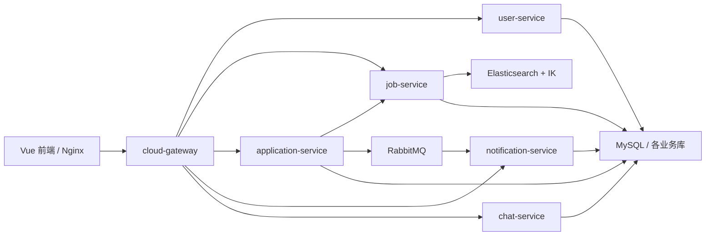

# Hire / 智聘招聘平台后端

面向求职者、企业与管理员的招聘平台，采用 Java 17、Spring Boot 2.7.6、Spring Cloud 2021.0.3 和 Spring Cloud Alibaba 2021.0.4.0 的微服务架构。实现用户与权限、职位搜索与审核、简历管理、职位投递、异步通知和招聘私信。

## 前后端仓库关联

| 仓库 | 内容 |
| --- | --- |
| [hire-backend](https://github.com/liuruibo07-creator/hire-backend) | 本仓库，网关、业务微服务、公共模块、数据库脚本及完整容器编排 |
| [hire-frontend](https://github.com/liuruibo07-creator/hire-frontend) | 用户指定的 `zhi-mi-front` 前端，Vue 3 + Element Plus + Vite；求职者、企业和管理员共用一个应用 |

前端接口说明见 [前端 docs/API.md](https://github.com/liuruibo07-creator/hire-frontend/blob/main/docs/API.md)。前端通过网关 `/api/**` 调用业务接口；聊天页面使用 REST 和增量轮询，后端同时支持 WebSocket。

## 功能

- 求职者：注册登录、资料与密码管理、职位筛选搜索、简历维护、投递进度、通知与私信。
- 企业：职位发布与编辑、审核后的上下架、收到的投递、简历查看、处理状态与备注、候选人私信。
- 管理员：平台统计、用户启停、职位审核与下架、投递巡检。
- 基础能力：JWT 鉴权、网关登录限流、Redis 缓存、Elasticsearch 中文检索、RabbitMQ 异步通知、Seata AT 分布式事务。

## 模块与技术

| 模块 | 端口 | 职责 |
| --- | --- | --- |
| cloud-gateway | 10086 | 请求路由、鉴权、身份透传、登录限流；支持 Nacos 动态路由 |
| user-service | 8081 | 用户、角色、资料、账户状态、管理员统计 |
| application-service | 8082 | 简历、投递、处理状态、投递统计与分布式事务 |
| job-service | 8083 | 职位、分类、审核、Elasticsearch 搜索与职位统计 |
| notification-service | 8084 | RabbitMQ 消费、通知保存、未读数与标读 |
| chat-service | 8085 | 会话、历史消息、已读位置与 WebSocket 推送 |
| cloud-api | — | 服务间 Feign 接口与请求拦截器 |
| cloud-common | — | JWT、上下文、异常、Redis、ID 等工具 |
| cloud-model | — | 实体、DTO、VO 和消息事件 |

数据层使用 MySQL 8、MyBatis、Redis；注册/配置中心使用 Nacos 2.x；职位检索使用 Elasticsearch 7.12.1 + 同版本 IK 插件；通知使用 RabbitMQ；事务协调器使用 Seata 2.0.0。



## 构建与本地开发

要求 JDK 17、Maven 3.8+。测试用 JWT 密钥必须显式提供：

```sh
export JWT_SECRET=unit-test-key-only-do-not-use-in-production-2026
mvn -B verify
# 按需只构建一个服务及它依赖的公共模块
mvn -B -pl job-service -am package -DskipTests
```

PowerShell 使用 `$env:JWT_SECRET='unit-test-key-only-do-not-use-in-production-2026'` 设置测试环境变量。应用运行时请提供至少 32 字符的独立随机密钥，所有服务保持一致。

原生启动前需准备可访问的 MySQL、Redis、Nacos、RabbitMQ、Elasticsearch/IK 与 Seata，并按实际环境设置 `NACOS_SERVER_ADDR`、`CLOUD_DATASOURCE_HOST`、`CLOUD_DATASOURCE_PASSWORD`、`SPRING_REDIS_HOST`、`SPRING_REDIS_PASSWORD`、`SPRING_RABBITMQ_HOST`、`RABBITMQ_USER`、`RABBITMQ_PASSWORD`、`CLOUD_ELASTICSEARCH_HOST` 和 Seata 的事务组映射与服务地址。可参考 [compose.yaml](compose.yaml) 的环境变量；Spring Boot 支持用环境变量覆盖 YAML 属性。构建后运行 `java -jar <服务>/target/<服务>-1.0.jar`。

## 容器化部署

完整说明见 [docs/DEPLOYMENT.md](docs/DEPLOYMENT.md)。本仓库提供后端多阶段 Dockerfile、单机 Compose、全新数据库初始化、Nacos、Redis、RabbitMQ、Elasticsearch/IK、Seata 与前端构建入口。前端仓库提供 Node.js 构建和 Nginx 运行镜像。

```sh
git clone https://github.com/liuruibo07-creator/hire-backend.git
git clone https://github.com/liuruibo07-creator/hire-frontend.git
cd hire-backend
cp .env.example .env
# 编辑 .env，替换所有 CHANGE_ME 值并生成至少 32 字符的随机 JWT 密钥
docker compose config --quiet
docker compose up -d --build
docker compose ps
```

Windows 可用 `Copy-Item .env.example .env`。默认浏览器入口为 `http://localhost:8080`，只有前端端口绑定到宿主机回环地址，中间件和业务服务只在 Compose 网络中互通。MySQL 的五个业务库及持久化卷由 Compose 管理。

## 接口与数据约定

`/api/user/**` 保留原路径；`/api/job/**`、`/api/application/**`、`/api/notification/**`、`/api/chat/**` 剥除前两段路径。JWT 放在 `Authorization: Bearer <token>` 中，业务身份由网关透传，客户端不应自行提供身份头。雪花算法 ID 在前端按字符串处理，防止精度丢失。

公开入口为注册、登录、职位搜索、数字 ID 的职位详情和职位分类。管理员账号不通过公开注册创建，部署人员可以先注册普通账号，再在受控数据库操作中将指定账号角色设为 `admin`。

本次公开发布采用当前源码的新提交，不携带原仓库历史和本机配置。源码中的固定密码和 JWT 密钥已改为环境变量；未包含真实用户记录、依赖目录、构建产物、IDE 文件及无关文档。

## 验证范围

2026-10-01 发布检查：现有后端 15 个测试套件共 103 项测试通过，六个运行服务均生成带启动入口的可执行 JAR；指定前端 11 项测试及 Vite 生产构建通过。完整 Maven 验证暴露的过时 Redis 测试配置已在本发布副本修正，并对受影响模块重跑验证；application-service 补充了 Spring Boot 打包插件。YAML 文件通过解析检查。

容器文件是单机开发/演示部署方案。发布时本机没有 Docker 引擎，镜像构建、容器启动及真实后端业务尚未端到端验证，不能把单元测试通过视为部署成功。全新安装的用户与职位 DDL 按当前 Mapper 补齐；已有数据库需要自行检查迁移差异，不要直接覆盖。
